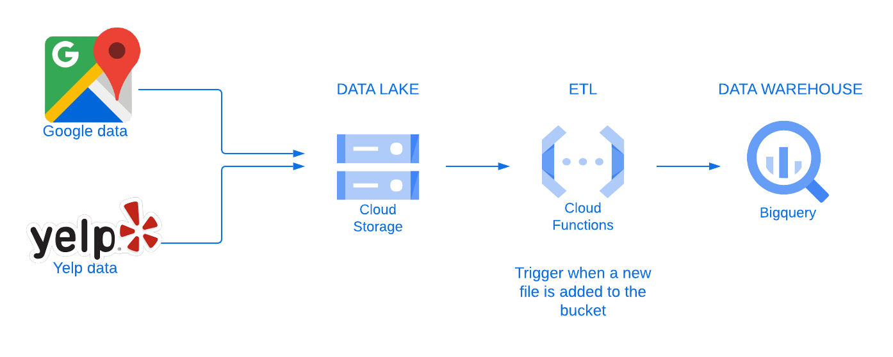
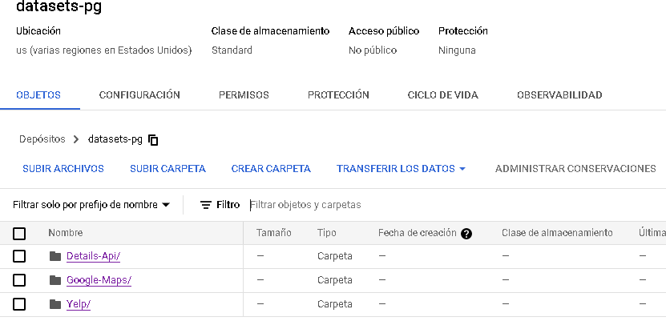
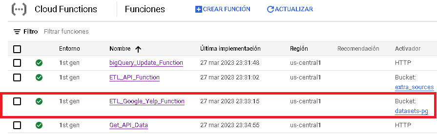
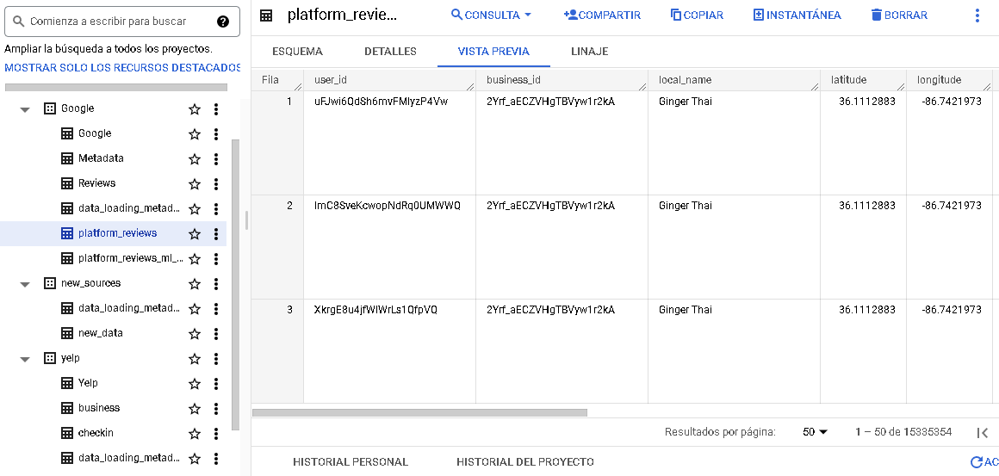

# **Data Processing**

Una de las cosas más importantes de este proyecto es el tratamiento y organización de los datos. A continuación se muestra el esquema del procesamiento de los datos.

## Partes del Proceso

- [Data Lake](#data-lake)
- [Cloud Functions](#cloud-functions)
- [Data Warehouse](#data-warehouse)
- [Technologies](#technologies)

## Data Lake

La parte inicial de este proyecto es cargar los datos sin procesar que se nos proporcionaron y almacenarlos en nuestro Data Lake.
 
**Qué es un Data Lake ?**
 
Un Data Lake es un sistema de almacenamiento de datos que permite almacenar grandes cantidades de datos en su formato nativo, sin necesidad de estructuración previa, permitiendo un acceso más rápido y flexible a los datos. Vamos a utilizar Google Cloud Storage para almacenar los datos sin procesar de Google y Yelp.
 
**Por qué Google Cloud Storage ?**
 
Elegimos Google Cloud Services en general porque tienen una interfaz de usuario increíble, muy fácil de usar y muy completa. Además, un hecho importante son sus precios competitivos. No encontramos ninguna razón para no utilizar Google Cloud Services.
 

## Cloud Functions

El servicio Google Cloud Functions por medio de funciones se encargará de extraer los datos del Data Lake, transformarlos/limpiarlos y cargarlos en nuestro Data Warehouse, lo cual se explicará en detalle más adelante.
 
**Por qué usamos Google Cloud Functions?**
 
Usamos Cloud Functions porque nos ayudará a automatizar el proceso de ETL. Las funciones almacenadas allí estarán asociadas a un disparador, ese disparador consiste en detectar cuando se carga un nuevo archivo en nuestro Data Lake, después de eso, las funciones de Transformación harán su trabajo y limpiarán y transformarán los datos sin procesar y almacenarán los datos procesados ​​en nuestro Data Warehouse.
 
También automatizará la adición de nuevos datos. Una de las funciones limpiará/transformará estos nuevos datos externos y ejecutará una consulta en Google BigQuery para actualizar los datos actuales.

## Data Warehouse
**En qué consiste el servicio de Google BigQuery?**
 
Google BigQuery es un servicio de Data Warehouse de Google que vamos a utilizar para almacenar y estructurar nuestros datos procesados. Mediante Google SQL podremos realizar nuestras propias consultas. El equipo de Data Scientist y el equipo de Data Analytics utilizarán estos datos estructurados para sus diferentes necesidades.
 
El Data Warehouse podrá actualizarse con nuevos datos en cualquier momento desde fuentes externas. En este proyecto, para aumentar nuestros datos, extraeremos nuevos datos de una API. Este proceso será abordado en el apartado referente a la API y a su extracción.

 

## Tecnologías

* Google Cloud Plataform (GCP)
* Google Cloud Storage
* Google Cloud Function
* Google BigQuery
* Pandas
* Python